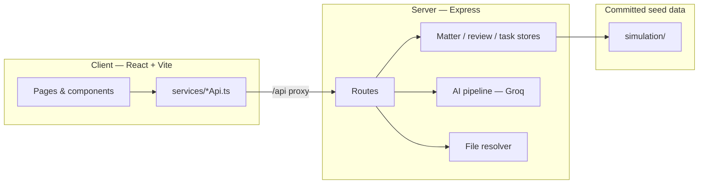

# Rialu DataRoom

**AI-native virtual data room for M&A legal due diligence.**

Rialu is a full-stack demo application that models how a deal team reviews documents in a transaction data room: folder taxonomy, interactive clause review, role-based workflow, AI-powered analysis, and exportable diligence reports.

> **Disclaimer:** All company names, documents, and legal content are fictional and generated for demonstration. This is not legal advice.

## Features

- **Virtual data room** — folder tree, document explorer, upload, and PDF / interactive text review
- **AI document analysis** — per-document summaries, clause extraction, and diligence flags via [Groq](https://groq.com)
- **Team workflow** — role-based demo users (trainee → partner), task assignment, comments, escalation, and document deep-links with passage highlighting
- **Diligence tooling** — review panels, risk register, cross-document synthesis, PPTX / XLSX export
- **Built-in demo matter** — 94-document fictional *Acme AI Limited* Series B acquisition (`matter-acme`)

## Quick start

**Prerequisites:** Node.js 20+, npm

```bash
git clone https://github.com/graemescaife/Rialu-DataRoom.git
cd Rialu-DataRoom
npm install

cp server/.env.example server/.env
# Add your Groq API key to server/.env (optional — demo room works without AI)

npm run dev
```

| Service | URL |
|---------|-----|
| Web app | http://localhost:5173 |
| API | http://localhost:3001 |

On first load, select a demo user (e.g. Associate) to enter the workspace. Open **Project Northwind / Acme AI Ltd** to explore the pre-seeded data room.

## Architecture



See [docs/ARCHITECTURE.md](docs/ARCHITECTURE.md) for module layout, API surface, and design decisions.

## Project structure

```
Rialu-DataRoom/
├── client/                 # React 18, TypeScript, Tailwind, Vite
│   └── src/
│       ├── pages/          # Route-level views
│       ├── components/     # UI by domain (document, workflow, explorer, …)
│       ├── services/       # Typed fetch wrappers for /api
│       └── hooks/          # Shared client logic
├── server/                 # Express API
│   └── src/
│       ├── routes/         # taskRoutes, aiRoutes
│       ├── ai/             # Groq client, classifier, analyzer
│       └── *.js            # Stores, upload, export, orchestration
├── simulation/             # Seeded demo matter (94 docs + preview text)
├── demo-data-rooms/        # Source tree for regenerating simulation assets
└── docs/                   # Architecture & contributor notes
```

## Demo walkthrough

1. **Login** — pick a role (e.g. Priya Sharma, Associate)
2. **Matters** — open *Project Northwind / Acme AI Ltd*
3. **Data room** — browse folders, open a document, switch between Review and PDF tabs
4. **Workflow** — view assigned tasks; open a clause-review task to see highlighted passage
5. **AI** *(requires `GROQ_API_KEY`)* — run per-document analysis or a full-matter review from the dashboard

## Scripts

| Command | Description |
|---------|-------------|
| `npm run dev` | Start API + client concurrently |
| `npm run build` | Production build of client |
| `npm run start:server` | API only (port 3001) |
| `npm run dataroom:generate` | Regenerate Acme AI demo document pack |
| `npm run simulate:generate` | Regenerate simulation manifest |

## Environment variables

All secrets live in `server/.env` (never committed). See [server/.env.example](server/.env.example).

| Variable | Required | Description |
|----------|----------|-------------|
| `GROQ_API_KEY` | For AI features | Groq API key |
| `GROQ_MODEL` | No | Default `llama-3.3-70b-versatile` |
| `GROQ_ANALYZE_DELAY_MS` | No | Rate-limit delay between batch jobs |
| `PORT` | No | API port (default 3001) |

## Tech stack

- **Frontend:** React 18, TypeScript, React Router, Tailwind CSS, Vite
- **Backend:** Node.js, Express, multer
- **AI:** Groq (Llama 3.3 70B)
- **Documents:** pdf-parse, xlsx, pptxgenjs, pdfkit

## License

MIT — see [LICENSE](LICENSE).
